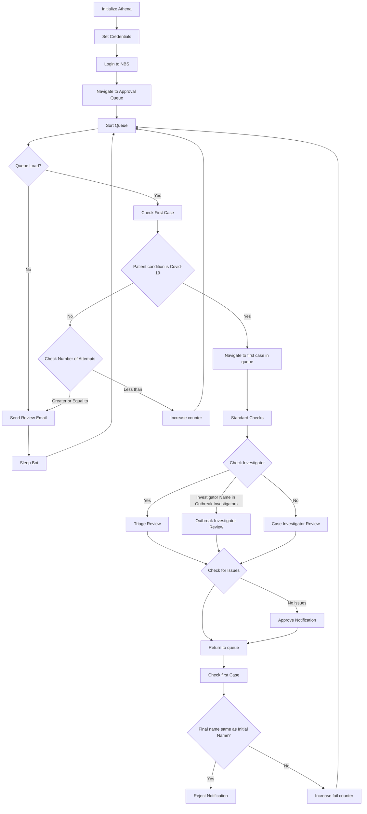

# Athena Bot Documentation

## Table of Contents
1. [Non-Technical Overview](#non-technical-overview)
2. [Technical Documentation](#technical-documentation)
3. [Developer Reference](#developer-reference)
4. [System Diagrams](#system-diagrams)

# Non-Technical Overview

## Purpose
Athena Bot reviews COVID-19 cases and reports using emails to NBS personnel. It processes cases, validates data, and flags issues for manual review.

## Key Features
- Automated case processing
- Data validation
- Email notifications
- Manual review flagging
- Patient data verification
- Lab data verification
- Investigator verification

## Business Benefits
- Reduced manual processing time
- Consistent data validation
- Automated quality checks
- Streamlined case management
- Improved data accuracy

# Technical Documentation

## System Overview
Athena Bot extends Athena which inherits from Base Bot allowing access to all its functionality. It includes:
- Automated login and navigation
- Comprehensive data validation
- Error handling and recovery
- Reporting functionality
- Integration with external services (USPS, SMTP)

## Core Workflows

### 1. Case Processing
- Queue management
- Case sorting
- Data validation
- Issue flagging

### 2. Reporting
- Email notifications
- Manual review logging
- Status updates

# Developer Reference

## Code Structure

### Base Class
```python
class Athena(NBSdriver):
    """ A class to review COVID-19 cases in the notification queue.
    It inherits from NBSdriver."""
```

### Key Components
1. Navigation Methods
   - Queue management
   - Case navigation

2. Data Validation
   - Demographics
   - Lab data
   - Case Info
   - Dates
   - Investigator status

## Validation Checks

### Demographic Validation
1. Personal Information
   - Name verification
   - DOB validation
   - Address verification
   - Sex validation

2. Location Data
   - City verification
   - State/country checks
   - ZIP code validation
   - County verification
   - Ethnicity/Race verification

### Lab Data Management
1. Lab Reading
   - Associated labs
   - Assign lab types
   - Case status check
   - Collection Date
   - Report Date 

### Medical Information
1. Case Status
   - Jurisdiction check
   - Program Area check
   - Investigation Start
   - Investigation status
   - Shared Indicator 
   - State CaseID
   - Lost To FollowUp
   - Report Date
   - Investigator Assigned Date
   - County State Report Date
   - Reporting Source Type
   - Reporting Organization
   - Performing Laboratory
   - Collection Date
   - Current Status
   - Probable Reason
   - Confirmation method
   - Detection method

2. Hospitalization checks
   - Hospitalization Indicator
   - Hospital Name
   - Admission Date
   - Discharge Date
   - Icu Indicator
   - Icu Admission Date
   - Icu Discharge Date
   - Die From Illness
   - Death Date
   - Congregate Setting
   - Congregate Facility Name

3. Workers
   - First Responder
   - First Responder Org
   - Healthcare Worker 
   - Healthcare Worker Facility
   - Healthcare Worker Job
   - Healthcare Worker Job Other
   - Healthcare Worker Setting
   - Healthcare Worker Setting Other

3. Dates
   - Report dates
   - Admission dates
   - Confirmation dates

### Required Fields
- Personal identifiers
- Location data
- Medical information
- Reporting details
- MMWR data

## Error Handling

### Retry Logic
- Configurable attempts
- Timeout management
- Session recovery

### Issue Tracking
- Validation issues log
- Manual review queue
- Lab data issues

## Integration Points

### External Services
- USPS API
- SMTP email
- Chrome WebDriver
- RSA authentication

# System Diagrams

## Class Structure

```mermaid
classDiagram
    class Athena {
        +num_approved = 0
        +num_rejected = 0
        +num_fail = 0

        +__init__(self, production)
        super().__init__(production)
        +StandardChecks()
        +CheckCongregateSetting()
        +CheckCongregateFacilityName()
        +CheckFirstResponder()
        +CheckFirstResponderOrg()
        +CheckHealthcareWorker()
        +CheckHealtcareWorkerFacility()
        +CheckHealthcareWorkerJob()
        +CheckHealthcareWorkerJobOther()
        +CheckHealthcareWorkerSetting()
        +CheckHealthcareWorkerSettingOther()
        +CheckCurrentStatus()
        +CheckProbableReason()
        +CheckExposureSection()
        +CheckDomesticTravel()
        +CheckShipTravel()
        +CheckSchoolExposure()
        +CheckDaycareExposure()
        +CheckOutbreakExposure()
        +CheckTransmissionMode()
        +CheckCaseStatus()
        +CheckLostToFollowUp()
        +CheckClosedDate()
        +CheckHospitalizationIndicator()
        +CheckHospitalName()
        +CheckIcuIndicator()
        +CheckIcuAdmissionDate()
        +CheckIcuDischargeDate()
        +CheckDieFromIllness()
        +CheckDeathDate()
        +CheckJurisdiction()
        +CheckProgramArea()
        +CheckInvestigationStartDate()
        +CheckSharedIndicator()
        +CheckStateCaseID()
        +ReadAssociatedLabs()
        +AssignLabTypes()
        +DetermineCaseStatus()
        +GetReportDate()
        +GetCollectionDate()
        +ReadAoes()
        +CheckFirstAttemptDate()
        +CheckHospAOE()
        +CheckIcuAOE()
        +CheckHcwAOE()
        +CheckSympAOE()
        +CheckCongAOE()
        +CheckFirstResponderAOE()
        +CheckPregnancyAOE()
        +CheckCollectionDate()
        +CheckNonWhiteEthnicity()
        +CheckRace()
        +CheckNonWhiteRace()
        +CheckDOB()
        +CheckCurrentSex()
        +CheckStAddr()
        +CheckInvestigator()
        +CheckInvestigatorAssignDate()
        +ExposureChecks()
        +AOEChecks()
        +CaseInvestigatorReview()
        +OutbreakInvestigatorReview()
        +TriageReview()
        +ReviewCase()
        +CheckImmPactQuery()
        +CheckRecievedVax()
        +CheckFullyVaccinated()
        +CheckTestingPerformed()
        +CheckLabTable()
        +CheckSymptoms()
        +CheckSymptomDatesAndStatus()
        +CheckIllness_Duration()
        +CheckInvestigator()
        +CheckInvestigatorAssignDate()
        +ApproveNotification()
        +RejectNotification()
    }

    class AthenaBot {
        +set_credentials(username, passcode)
        +log_in()
        +GoToApprovalQueue()
        +SortApprovalQueue()
        +SendManualReviewEmail()
        +Sleep()
        +CheckFirstCase()
        +GoToFirstCaseInApprovalQueue()
        +StandardChecks()
        +TriageReview()
        +OutbreakInvestigatorReview()
        +CaseInvestigatorReview()
        +ApproveNotification()
        +ReturnApprovalQueue()
        +RejectNotification()
    }
    
    AthenaBot --|> Athena
    
    note for AthenaBot "Extends Athena which extends Base Bot\nHandles NBS initialization, authentication and miscellaneous methods"
```


## Process Flow


# Maintenance Guidelines

## Configuration Updates
- Regular review of timeouts
- Email list maintenance
- API credential updates
- Retry attempt optimization

## Monitoring
- Manual review frequency
- Timeout occurrences
- Email notification success
- SSL certificate status

## Performance Optimization
- Wait time review
- Queue processing efficiency
- Batch size adjustments
- Resource utilization

# Support and Troubleshooting

## Common Issues
1. Login Failures
   - Check RSA token
   - Verify SSL certificates
   - Confirm credentials

2. Timeout Issues
   - Review wait settings
   - Check network connectivity
   - Verify NBS availability

3. Validation Errors
   - Check data completeness
   - Verify field formats
   - Review business rules
