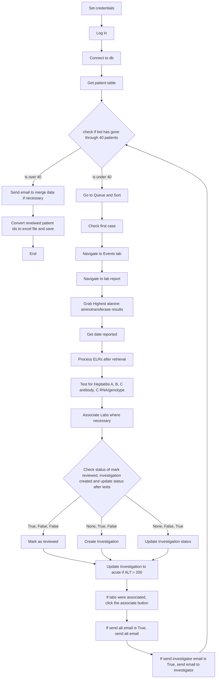

# Audrey Bot Documentation

## Table of Contents
1. [Non-Technical Overview](#non-technical-overview)
2. [Technical Documentation](#technical-documentation)
3. [Developer Reference](#developer-reference)
4. [System Diagrams](#system-diagrams)

# Non-Technical Overview

## Purpose
Audrey Bot reviews hepatitis cases and reports using emails to NBS personnel. It processes cases, validates data, and flags issues for manual review.

## Key Features
- Direct Data retrieval
- Automated case processing
- Data validation
- Email notifications
- Manual review flagging
- Patient data verification
- Lab data processing
- Investigation review
- Data Manipulation

## Business Benefits
- Reduced manual processing time
- Consistent data validation
- Automated quality checks
- Streamlined case management
- Improved data accuracy

# Technical Documentation

## System Overview
Audrey Bot extends Audrey which inherits from Base Bot allowing access to all its functionality. It includes:
- Automated login and navigation
- Comprehensive data processing and validation
- Error handling and recovery
- Reporting functionality
- Integration with external services (USPS, SMTP, ODSE)

## Core Workflows

### 1. Case Processing
- Data retrieval
- Queue management
- Case sorting
- Data validation
- Issue flagging
- Data processing

### 2. Reporting
- Email notifications
- Manual review logging
- Status updates

# Developer Reference

## Code Structure

### Base Class
```python
class Audrey(NBSdriver):
    """ A class that inherits all basic NBS functionality from NBSdriver and adds
    methods to retrieve adn validate data for hepatitis."""
```

### Key Components
1. Set up
   - Database connection
   - Data retrieval

2. Navigation Methods
   - Queue management
   - Case navigation

3. Data Validation
   - Demographics
   - Investigation review
   - Lab data
   - Test types
   - Dates

4. Data Manipulation
   - Lab association
   - Investigation creation
   - Case status
   - Lab info

## Validation Checks

### Demographic Validation
1. Personal Information
   - Name verification
   - DOB validation
   - Address verification
   - Sex validation

2. Location Data
   - City verification
   - State/country checks
   - ZIP code validation
   - County verification
   - Ethnicity/Race verification

### Lab Data Management
1. Lab Reading
   - Associated labs
   - Assign lab types
   - Case status check
   - Collection Date
   - Report Date 

### Run Tests 
1. Hepatitis A, B, C
2. Antibody, genotype

## Error Handling

### Retry Logic
- Configurable attempts
- Timeout management
- Session recovery

### Issue Tracking
- Validation issues log
- Manual review queue
- Lab data issues

## Integration Points

### External Services
- ODSE Database connector
- USPS API
- SMTP email
- Chrome WebDriver
- RSA authentication

# System Diagrams

## Class Structure

```mermaid
classDiagram
    class Audrey {
        +incomplete_address_log: list
        +failed_immpact_query_log: list 
        +unambigous_races
        +unambiguous_race_paths
        +ethnicity_path: string
        +street_path: string
        +city_path: string
        +zip_path: string
        +county_path: string


        +reset()
        +get_db_connection_info()
        +get_patient_table()
        +get_unassigned_covid_labs()
        +select_counties()
        +select_min_delay()
        +get_age_range()
        +select_aoe_filters()
        +check_for_possible_merges()
        +check_patient_hospitalization_status()
        +check_for_existing_investigation()
        +create_investigation()
        +query_immpact()
        +id_covid_vaccinations()
        +import_covid_vaccinations()
        +determine_vaccination_status()
        +read_street()
        +read_city()
        +read_zip()
        +write_zip()
        +read_county()
        +write_county()
        +read_address()
        +set_state()
        +set_country()
        +check_ethnicity()
        +clear_ambiguous_race_answers()
        +check_race()
        +read_demographic_address()
        +write_demographic_address()
        +read_demographic_race()
        +write_demographic_race()
        +read_demographic_ethnicity()
        +write_demographic_ethnicity()
        +set_investigation_start_date()
        +set_investigation_status_closed()
        +set_state_case_id()
        +read_investigation_id()
        +set_county_and_state_report_datesreport_to_ph_date()
        +update_report_date()
        +set_performing_lab()
        +set_earliest_positive_collection_datelab_collection_date()
        +set_case_status()
        +review_case_status()
        +update_aoe()
        +update_case_info_aoes()
        +update_pregnant_aoe()
        +update_symptom_aoe()
        +set_confirmation_date()
        +set_closed_date()
        +set_immpact_query_to_yes()
        +set_vaccination_fields()
        +set_lab_testing_performed()
        +set_mmwr()
        +check_jurisdiction()
        +create_notification()
        +send_bad_address_email()           
        +send_failed_query_email()        
        +pause_for_database()
    }

    class AudreyBot {
        +set_credentials()
        +log_in()
        +get_db_connection_info()
        +get_patient_table()
        +pause_for_database()
        +SortQueue()
        +CheckFirstCase()
        +GoToEventsTab()
        +NavigateToLabReport()
        +CheckForHighestAlanine()
        +DateReported()
        +ProcessELRs()
        +HasInvestigation()
        +MultipleProbaleInvestigation()
        +TestHepatitisA()
        +TestHepatitisCAntibody()
        +TestHepatitisCRNA()
        +TestHepatitisB()
        +ALTTest()
        +AssociateLab()
        +AddressFromMaine()
        +CreateInvestigation()
        +SetCaseStatus()
        +AddLabInfo()
        +ChangeConfirmationDate()
        +UpdateConfirmationDate()
        +EnterConfirmed()
        +Overwrite()
        +GoToPatientPage()
        +UpdateInvestigationALT()
    }

    AudreyBot --|> Audrey
```


## Process Flow

# Maintenance Guidelines

## Configuration Updates
- Regular review of timeouts
- Email list maintenance
- API credential updates
- Retry attempt optimization

## Monitoring
- Manual review frequency
- Timeout occurrences
- Email notification success
- SSL certificate status

## Performance Optimization
- Wait time review
- Queue processing efficiency
- Batch size adjustments
- Resource utilization

# Support and Troubleshooting

## Common Issues
1. Login Failures
   - Check RSA token
   - Verify SSL certificates
   - Confirm credentials

2. Timeout Issues
   - Review wait settings
   - Check network connectivity
   - Verify NBS availability

3. Validation Errors
   - Check data completeness
   - Verify field formats
   - Review business rules
