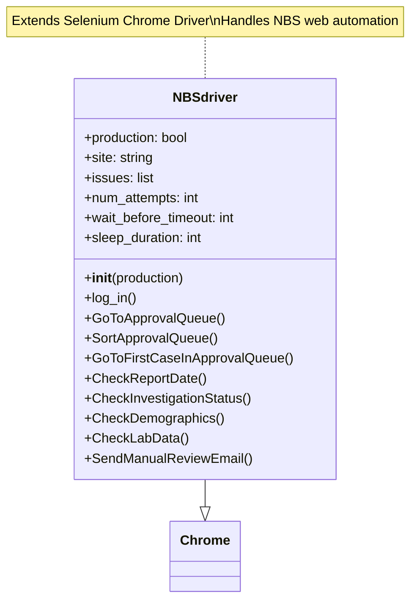
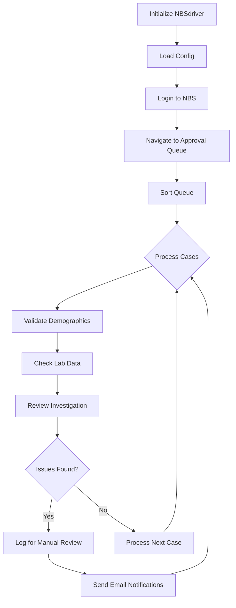
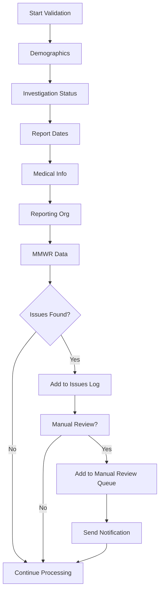

# Base Bot Documentation

## Table of Contents
1. [Non-Technical Overview](#non-technical-overview)
2. [Technical Documentation](#technical-documentation)
3. [Developer Reference](#developer-reference)
4. [System Diagrams](#system-diagrams)

# Non-Technical Overview

## Purpose
Base Bot automates case management in the NBS system. It processes cases, validates data, and flags issues for manual review.

## Key Features
- Automated case processing
- Data validation
- Email notifications
- Manual review flagging
- Address verification
- Lab data verification

## Business Benefits
- Reduced manual processing time
- Consistent data validation
- Automated quality checks
- Streamlined case management
- Improved data accuracy

# Technical Documentation

## System Overview
Base Bot extends Selenium's Chrome WebDriver for web automation of the NBS system. It includes:
- Automated login and navigation
- Comprehensive data validation
- Error handling and recovery
- Reporting functionality
- Integration with external services (USPS, SMTP)

## Core Workflows

### 1. Initialization
- Load configurations
- Set up Chrome WebDriver
- Initialize credentials
- Configure timeouts

### 2. Authentication
- Process user credentials
- Handle SSL certificates
- Manage session state

### 3. Case Processing
- Queue management
- Case sorting
- Data validation
- Issue flagging

### 4. Reporting
- Email notifications
- Manual review logging
- Status updates

# Developer Reference

## Code Structure

### Base Class
```python
class NBSdriver(webdriver.Chrome):
    """ A class to provide basic functionality in NBS via Selenium. """
```

### Key Components
1. Configuration Management
   - Config file handling
   - Environment selection
   - API credentials

2. Navigation Methods
   - Queue management
   - Case navigation
   - Form handling

3. Data Validation
   - Demographics
   - Lab data
   - Dates
   - Addresses

## Validation Checks

### Demographic Validation
1. Personal Information
   - Name verification
   - DOB validation
   - Address verification

2. Location Data
   - ZIP code validation
   - County verification
   - State/country checks

### Medical Information
1. Case Status
   - Investigation status
   - Confirmation method
   - Detection method

2. Dates
   - Report dates
   - Admission dates
   - Confirmation dates

### Required Fields
- Personal identifiers
- Location data
- Medical information
- Reporting details
- MMWR data

## Error Handling

### Retry Logic
- Configurable attempts
- Timeout management
- Session recovery

### Issue Tracking
- Validation issues log
- Manual review queue
- Lab data issues

## Integration Points

### External Services
- USPS API
- SMTP email
- Chrome WebDriver
- RSA authentication

### Data Exchange
- Lab data processing
- Address verification
- Email notifications

# System Diagrams

## Class Structure


## Process Flow


## Validation Flow


# Maintenance Guidelines

## Configuration Updates
- Regular review of timeouts
- Email list maintenance
- API credential updates
- Retry attempt optimization

## Monitoring
- Manual review frequency
- Timeout occurrences
- Email notification success
- SSL certificate status

## Performance Optimization
- Wait time review
- Queue processing efficiency
- Batch size adjustments
- Resource utilization

# Support and Troubleshooting

## Common Issues
1. Login Failures
   - Check RSA token
   - Verify SSL certificates
   - Confirm credentials

2. Timeout Issues
   - Review wait settings
   - Check network connectivity
   - Verify NBS availability

3. Validation Errors
   - Check data completeness
   - Verify field formats
   - Review business rules

## Contact Information
- Technical Support: [Contact Information]
- System Administrator: [Contact Information]
- Data Team: [Contact Information]